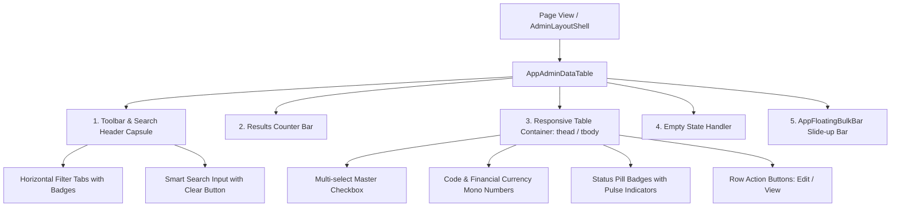

# 📐 Blueprint: Modern Enterprise Compact Data Table & Multi-Select Bulk Actions

> **Tier 3 Blueprint (Apex v2.5.3):** สถาปัตยกรรมตารางข้อมูลสำหรับระบบ Enterprise Dashboard สไตล์ Modern & Compact Data Density พร้อม Search Header Capsule, Horizontal Filter Tabs, Multi-select Checkbox, Financial Currency Mono Formatting, Status Pills และ Floating Bulk Action Bar

---

## 🏗️ 1. Component Hierarchy & Flow



---

## 🎨 2. Standard Design Tokens

| UI Element | CSS / Tailwind Tokens | Purpose |
|---|---|---|
| **Toolbar Capsule** | `rounded-3xl border border-slate-200 dark:border-slate-800 bg-white dark:bg-slate-900 p-3.5 shadow-xs` | แถบเครื่องมือรวม Search และ Filter Tabs |
| **Active Filter Tab** | `bg-[#1C4D8D] text-white shadow-md shadow-[#1C4D8D]/25 rounded-2xl text-xs font-bold` | ไฮไลท์แท็บที่กำลังเลือก |
| **Row Selected Highlight** | `bg-blue-50/60 dark:bg-blue-950/30` | ไฮไลท์แถวเมื่อถูกเลือก Checkbox |
| **Financial Figures** | `font-mono font-black tabular-nums text-sm` | ตัวเลขราคา/การเงิน จัดชิดขวา อ่านง่าย |
| **Status Pill Badges** | `rounded-full text-[11px] font-bold px-2.5 py-1 flex items-center gap-1.5` | ป้ายสถานะพร้อมจุดกลม Indicator |
| **Floating Bulk Bar** | `fixed bottom-6 inset-x-4 max-w-xl mx-auto z-50 bg-[#0F2854] text-white p-3.5 rounded-3xl shadow-2xl` | แถบลอยล่างจอสำหรับจัดการหลายรายการ |

---

## 💻 3. Quick Start & Integration Example (Nuxt 4 / Vue 3)

### ไฟล์คอมโพเนนต์หลัก:
- 📄 [`templates/ui/vue/AppAdminDataTable.vue`](../ui/vue/AppAdminDataTable.vue)
- 📄 [`templates/ui/vue/AppFloatingBulkBar.vue`](../ui/vue/AppFloatingBulkBar.vue)
- 📄 [`templates/ui/vue/AdminLayoutShell.vue`](../ui/vue/AdminLayoutShell.vue)

### ตัวอย่างการเรียกใช้ในหน้า Page:

```vue
<script setup lang="ts">
import { ref } from 'vue'
import AdminLayoutShell from '~/templates/ui/vue/AdminLayoutShell.vue'
import AppAdminDataTable, { type EnterpriseRecord } from '~/templates/ui/vue/AppAdminDataTable.vue'

const isDeleteLoading = ref(false)

const handleEdit = (record: EnterpriseRecord) => {
  console.log('Edit record:', record.code)
}

const handleDeleteSelected = async (ids: Array<string | number>) => {
  if (confirm(`คุณต้องการลบรายการที่เลือกจำนวน ${ids.length} รายการหรือไม่?`)) {
    isDeleteLoading.value = true
    // Simulate API call
    setTimeout(() => {
      isDeleteLoading.value = false
      alert(`ลบรายการ ${ids.join(', ')} สำเร็จ`)
    }, 1000)
  }
}
</script>

<template>
  <AdminLayoutShell page-title="รายการธุรกรรม & บิล (Transactions)">
    <AppAdminDataTable
      title="รายการบิลและธุรกรรมทั้งหมด"
      :delete-loading="isDeleteLoading"
      @edit="handleEdit"
      @delete-selected="handleDeleteSelected"
    />
  </AdminLayoutShell>
</template>
```

---

## ⚛️ 4. Quick Start & Integration Example (React 19 / Next.js 15)

### ไฟล์คอมโพเนนต์หลัก:
- 📄 [`templates/ui/react/AppAdminDataTable.tsx`](../ui/react/AppAdminDataTable.tsx)
- 📄 [`templates/ui/react/AppFloatingBulkBar.tsx`](../ui/react/AppFloatingBulkBar.tsx)
- 📄 [`templates/ui/react/AdminLayoutShell.tsx`](../ui/react/AdminLayoutShell.tsx)

### ตัวอย่างการเรียกใช้ในหน้า Page:

```tsx
'use client'

import React, { useState } from 'react'
import { AdminLayoutShell } from '@/templates/ui/react/AdminLayoutShell'
import { AppAdminDataTable, type EnterpriseRecord } from '@/templates/ui/react/AppAdminDataTable'

export default function TransactionsPage() {
  const [isDeleteLoading, setIsDeleteLoading] = useState(false)

  const handleEdit = (record: EnterpriseRecord) => {
    console.log('Edit record:', record.code)
  }

  const handleDeleteSelected = async (ids: (string | number)[]) => {
    if (window.confirm(`คุณต้องการลบรายการที่เลือกจำนวน ${ids.length} รายการหรือไม่?`)) {
      setIsDeleteLoading(true)
      // Simulate API call
      setTimeout(() => {
        setIsDeleteLoading(false)
        alert(`ลบรายการ ${ids.join(', ')} สำเร็จ`)
      }, 1000)
    }
  }

  return (
    <AdminLayoutShell pageTitle="รายการธุรกรรม & บิล (Transactions)">
      <AppAdminDataTable
        title="รายการบิลและธุรกรรมทั้งหมด"
        deleteLoading={isDeleteLoading}
        onEdit={handleEdit}
        onDeleteSelected={handleDeleteSelected}
      />
    </AdminLayoutShell>
  )
}
```

---

## 🛡️ 5. Backend Atomic Bulk Delete Endpoint (H3 / Nitro / Route Handlers)

```typescript
// server/api/v1/[resource]/bulk-delete.post.ts
import { defineEventHandler, readBody, createError } from 'h3'
import { prisma } from '~/server/utils/prisma'

export default defineEventHandler(async (event) => {
  const body = await readBody(event)
  const { ids } = body

  if (!Array.isArray(ids) || ids.length === 0) {
    throw createError({
      statusCode: 400,
      statusMessage: 'กรุณาระบุรายการที่ต้องการลบ (Array of IDs required)',
    })
  }

  // Atomic batch delete
  const result = await prisma.transaction.deleteMany({
    where: { id: { in: ids } }
  })

  return {
    success: true,
    message: `ลบข้อมูลจำนวน ${result.count} รายการเรียบร้อยแล้ว`,
    count: result.count,
  }
})
```

