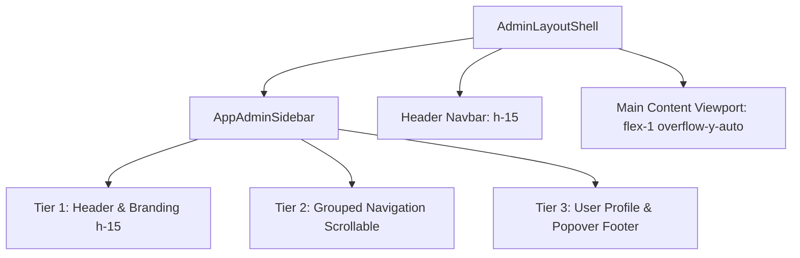

# 📐 Blueprint: Modern Enterprise Responsive Admin Sidebar & Layout Shell

> **Tier 3 Blueprint (Apex v2.5.3):** สถาปัตยกรรมแถบเมนูข้าง (Sidebar) และโครงสร้าง Layout Shell สไตล์ Modern Enterprise Compact SaaS Density รองรับ Desktop Dual-State (Expanded/Collapsed), Mobile Off-canvas Slide Drawer, Vertical 3-Tier Flexbox, และ Upward Popover Footer

---

## 🏗️ 1. Architecture & Responsive Layout



### 📱 Responsive Breakpoints:
- **Desktop View (`lg:` $\ge$ 1024px):**
  - **Expanded State (`w-64`):** แสดงโลโก้, ชื่อระบบ, หัวข้อกลุ่มเมนู, ป้าย Badge และชื่อ User ชัดเจน
  - **Collapsed State (`w-20`):** ย่อเหลือเฉพาะไอคอน พร้อม **Floating Border Button** (`absolute -right-3 top-4.5 w-6 h-6 rounded-full border shadow-md`) ลอยยื่นออกมาจากขอบขวาเพื่อให้กดขยายกลับได้ง่าย
  - **Memory Persistence:** บันทึกสถานะย่อ/ขยายลงใน `localStorage` (`apex_admin_sidebar_collapsed`) อัตโนมัติ
- **Mobile View (`< lg`):**
  - แสดงเป็น **Off-canvas Slide Drawer** (`-translate-x-full` / `translate-x-0` พร้อม `z-50`)
  - มี **Backdrop Blur Overlay** (`bg-slate-900/50 backdrop-blur-xs z-40`)
  - ปิด Drawer อัตโนมัติเมื่อกดเลือกเมนู

---

## 🎨 2. Design Tokens & Color Palette

| Token | Class / Value | หน้าที่ |
|---|---|---|
| **Primary Navy Brand** | `#1C4D8D` | สีพื้นหลังเมนู Active, ปุ่มหลัก, เงา Focus |
| **Deep Dark Brand** | `#0F2854` | สีกราเดียนต์ส่วนหัวของโลโก้ |
| **Ice Blue Accent** | `#DBE2EF`, `bg-blue-100` | สี Tag ระบบ และ Badge แจ้งเตือน |
| **Dark Mode Background** | `dark:bg-slate-900`, `dark:bg-slate-950` | โหมดมืดสำหรับ Sidebar และ App Shell |
| **Border Radius** | `rounded-xl` (Items/Buttons), `rounded-2xl` (Logo/Card/Popover) | ความโค้งมนระดับ Enterprise |

---

## 💻 3. Vue 3 / Nuxt 4 Implementation

### A. Component File: [`templates/ui/vue/AppAdminSidebar.vue`](../ui/vue/AppAdminSidebar.vue)
- Pure Vue 3 / Nuxt 4 Ready (Zero external CSS library dependencies)
- รองรับ TypeScript Interface: `NavGroup`, `NavItem`, `UserProfile`
- มี Upward Floating Popover สำหรับ Profile Footer พร้อมระบบตรวจจับ Click Outside อัตโนมัติ

### B. Layout Shell File: [`templates/ui/vue/AdminLayoutShell.vue`](../ui/vue/AdminLayoutShell.vue)
- แยก App Shell ออกจาก Page View ตามมาตรฐาน SaaS Dashboard Preset

### C. ตัวอย่างการเรียกใช้งานใน Nuxt 4 / Vue 3:

```vue
<!-- layouts/admin.vue หรือ pages/admin/index.vue -->
<script setup lang="ts">
import AdminLayoutShell from '~/templates/ui/vue/AdminLayoutShell.vue'
import type { NavGroup } from '~/templates/ui/vue/AppAdminSidebar.vue'

const navGroups: NavGroup[] = [
  {
    id: 'main',
    title: 'เมนูหลัก',
    items: [
      { id: 'dashboard', label: 'ภาพรวมระบบ', to: '/admin', active: true },
      { id: 'analytics', label: 'สถิติ & รายงาน', to: '/admin/analytics' },
    ]
  },
  {
    id: 'services',
    title: 'บริการ & การเงิน',
    items: [
      { id: 'billing', label: 'รอบบิล & แจ้งหนี้', to: '/admin/billing', badge: 'ประจำเดือน', badgeColor: 'blue' },
      { id: 'slips', label: 'ตรวจสลิปโอนเงิน', to: '/admin/slips', badge: '5 ใหม่', badgeColor: 'rose' },
      { id: 'contracts', label: 'สัญญาเช่า', to: '/admin/contracts' },
    ]
  },
  {
    id: 'system',
    title: 'ระบบ & สิทธิ์',
    items: [
      { id: 'users', label: 'จัดการผู้ใช้งาน', to: '/admin/users' },
      { id: 'settings', label: 'ตั้งค่าระบบ', to: '/admin/settings' },
    ]
  }
]

const currentUser = {
  name: 'สมชาย พัฒนากร',
  role: 'Super Administrator',
  email: 'somchai@enterprise.co.th',
  initials: 'SC'
}

const handleNavigate = (item: any) => {
  console.log('Navigate to:', item.to)
}

const handleLogout = () => {
  console.log('Logging out...')
}
</script>

<template>
  <AdminLayoutShell
    system-name="Apex Enterprise"
    system-tag="Admin v2.5"
    page-title="ภาพรวมระบบ (Dashboard)"
    :breadcrumbs="[{ label: 'หน้าหลัก', to: '/' }, { label: 'Admin', to: '/admin' }, { label: 'Dashboard' }]"
    :nav-groups="navGroups"
    :user="currentUser"
    @navigate="handleNavigate"
    @logout="handleLogout"
  >
    <!-- Main Dashboard Content Goes Here -->
    <div class="space-y-6">
      <div class="grid grid-cols-1 md:grid-cols-3 gap-4">
        <div class="p-5 bg-white dark:bg-slate-900 rounded-2xl border border-slate-200 dark:border-slate-800 shadow-xs">
          <p class="text-xs font-semibold text-slate-400">ยอดชำระเดือนนี้</p>
          <p class="text-2xl font-black text-slate-900 dark:text-white mt-1">฿245,000</p>
        </div>
      </div>
    </div>
  </AdminLayoutShell>
</template>
```

---

## ⚛️ 4. React (Next.js 15 / Vite) Implementation

### A. Component File: [`templates/ui/react/AppAdminSidebar.tsx`](../ui/react/AppAdminSidebar.tsx)
- Pure React 19 / Next.js 15 Ready (`'use client'`)
- TypeScript Interface: `NavGroup`, `NavItem`, `UserProfile`
- Upward Floating Popover for Profile Footer with Click Outside listener

### B. Layout Shell File: [`templates/ui/react/AdminLayoutShell.tsx`](../ui/react/AdminLayoutShell.tsx)

### C. ตัวอย่างการเรียกใช้งานใน Next.js 15 / React 19:

```tsx
'use client'

import React from 'react'
import { AdminLayoutShell } from '@/templates/ui/react/AdminLayoutShell'
import type { NavGroup, UserProfile } from '@/templates/ui/react/AppAdminSidebar'

const navGroups: NavGroup[] = [
  {
    id: 'main',
    title: 'เมนูหลัก',
    items: [
      { id: 'dashboard', label: 'ภาพรวมระบบ', to: '/admin', active: true },
      { id: 'analytics', label: 'สถิติ & รายงาน', to: '/admin/analytics' },
    ],
  },
  {
    id: 'services',
    title: 'บริการ & การเงิน',
    items: [
      { id: 'billing', label: 'รอบบิล & แจ้งหนี้', to: '/admin/billing', badge: 'ประจำเดือน', badgeColor: 'blue' },
      { id: 'slips', label: 'ตรวจสลิปโอนเงิน', to: '/admin/slips', badge: '5 ใหม่', badgeColor: 'rose' },
      { id: 'contracts', label: 'สัญญาเช่า', to: '/admin/contracts' },
    ],
  },
  {
    id: 'system',
    title: 'ระบบ & สิทธิ์',
    items: [
      { id: 'users', label: 'จัดการผู้ใช้งาน', to: '/admin/users' },
      { id: 'settings', label: 'ตั้งค่าระบบ', to: '/admin/settings' },
    ],
  },
]

const currentUser: UserProfile = {
  name: 'สมชาย พัฒนากร',
  role: 'Super Administrator',
  email: 'somchai@enterprise.co.th',
  initials: 'SC',
}

export default function AdminLayout({ children }: { children: React.ReactNode }) {
  const handleNavigate = (item: any) => {
    console.log('Navigate to:', item.to)
  }

  const handleLogout = () => {
    console.log('Logging out...')
  }

  return (
    <AdminLayoutShell
      systemName="Apex Enterprise"
      systemTag="Admin v2.5"
      pageTitle="ภาพรวมระบบ (Dashboard)"
      breadcrumbs={[{ label: 'หน้าหลัก', to: '/' }, { label: 'Admin', to: '/admin' }, { label: 'Dashboard' }]}
      navGroups={navGroups}
      user={currentUser}
      onNavigate={handleNavigate}
      onLogout={handleLogout}
    >
      <div className="space-y-6">
        <div className="grid grid-cols-1 md:grid-cols-3 gap-4">
          <div className="p-5 bg-white dark:bg-slate-900 rounded-2xl border border-slate-200 dark:border-slate-800 shadow-xs">
            <p className="text-xs font-semibold text-slate-400">ยอดชำระเดือนนี้</p>
            <p className="text-2xl font-black text-slate-900 dark:text-white mt-1">฿245,000</p>
          </div>
        </div>
        {children}
      </div>
    </AdminLayoutShell>
  )
}
```
